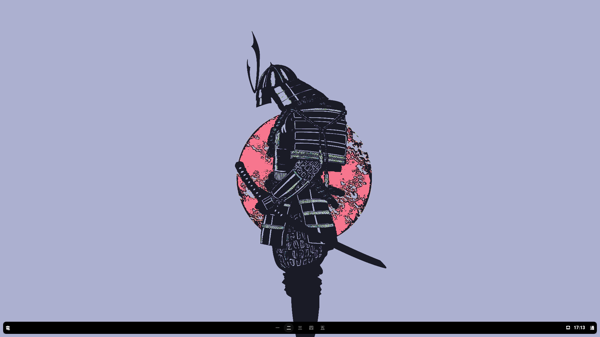
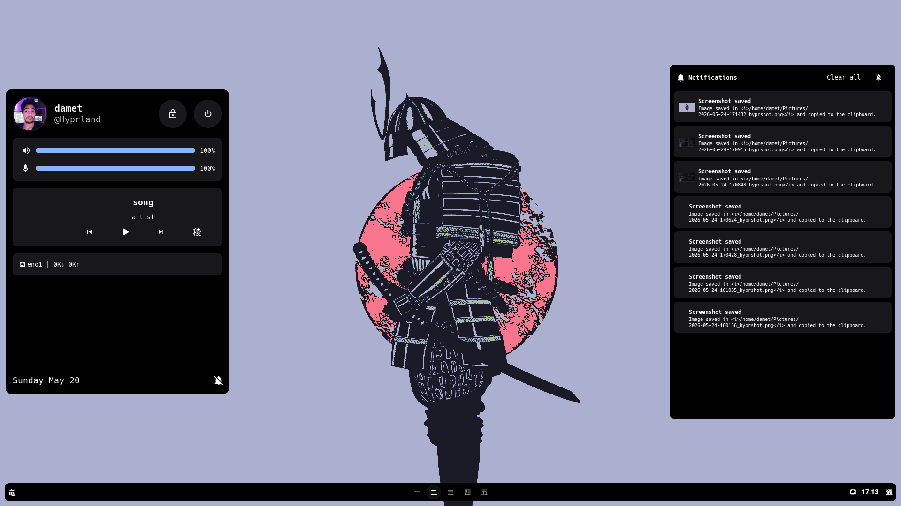

<h1 align="center">
    <div align="center">
        
    </div>
</h1>

<p align="center">
    <b>月</b> — Dotfiles for Hyprland, Waybar, Eww and more
</p>

<p align="center">
    
    
</p>

---

## Table of Contents

- [Stack](#stack)
- [Installation](#installation)
  - [Dependencies](#dependencies)
  - [dotctl](#dotctl)
- [Structure](#structure)
- [Usage](#usage)
  - [dotctl](#dotctl-1)
  - [Scripts](#scripts)
- [Customization](#customization)
  - [Waybar Themes](#waybar-themes)
  - [Colors](#colors)
- [Credits](#credits)

---

## Stack

| Component | Tool |
|-----------|------|
| Compositor | [Hyprland](https://hyprland.org/) (Lua) |
| Status Bar | [Waybar](https://github.com/Alexays/Waybar) |
| Widgets | [Eww](https://github.com/elkowar/eww) |
| Notifications | [end-rs](https://github.com/Dr-42/end-rs) + Eww |
| Lockscreen | [Hyprlock](https://github.com/hyprwm/hyprlock) |
| Terminal | [Kitty](https://github.com/kovidgoyal/kitty) |
| App Launcher | [Rofi](https://github.com/davatorium/rofi) |
| Editor | [Neovim](https://neovim.io/) (AstroVim) |
| Prompt | [Starship](https://starship.rs/) (Catppuccin Mocha) |
| Shell | Zsh (Oh My Zsh) |

---

## Installation

### Dependencies

Make sure you have the following tools installed:

- [awww](https://codeberg.org/LGFae/awww) — Animated wallpaper
- [eww](https://github.com/elkowar/eww) — Desktop widgets
- [end-rs](https://github.com/Dr-42/end-rs) — Notification daemon
- [waybar](https://github.com/Alexays/Waybar) — Status bar
- [Hyprlock](https://github.com/hyprwm/hyprlock) — Lock screen
- [kitty](https://github.com/kovidgoyal/kitty) — Terminal
- [rofi](https://github.com/davatorium/rofi) — App launcher
- [Neovim + AstroVim](https://astronvim.com/) — Editor
- [nmcli](https://networkmanager.dev/) — Network management


Use the included `scripts/sync` to symlink the config files to your `$HOME`:

```bash
git clone https://github.com/youruser/tsuki ~/tsuki
cd ~/tsuki
python3 scripts/sync init
python3 scripts/sync sync
```

> **Warning**: Review the files before syncing. `scripts/sync` will replace existing files in your `$HOME` (with `.bak` backup).

---

## Structure

```
├── .config/
│   ├── end-rs/       # Notification daemon config
│   ├── eww/          # Widgets (panel, music, OSD, notifications)
│   ├── hypr/         # Hyprland config (Lua)
│   ├── kitty/        # Terminal + ~100 themes
│   └── waybar/       # Status bar (ryu and minimal themes)
├── .dotctl/          # dotctl internal state
├── .github/images/   # Screenshots
├── scripts/          # Utility scripts (see below)
├── tests/            # dotctl tests
├── .zshrc            # Zsh config
├── starship.toml     # Starship prompt theme
├── LICENSE           # GPL v3
└── README.md
```

---

## Usage

### sync script

| Command | Description |
|---------|-------------|
| `scripts/sync sync` | Sync dotfiles to `$HOME` |
| `scripts/sync sync -f` | Force sync (backs up existing files) |
| `scripts/sync sync --dry-run` | Preview without writing |
| `scripts/sync diff` | Show differences between repo and `$HOME` |
| `scripts/sync status` | Show profile and tracked files |
| `scripts/sync init` | Initialize `.dotctl/` in the repo |
| `scripts/sync snapshot` | Save current state |
| `scripts/sync rollback <snapshot>` | Restore a previous state |
| `scripts/sync prune` | Clean up broken symlinks |

### Scripts

Scripts in `scripts/` are used by Eww and Waybar widgets:

| Script | Purpose |
|--------|---------|
| `battery` | Battery status |
| `cpu` | CPU usage |
| `memory` | Memory usage |
| `vol` | Audio volume (PipeWire) |
| `volume_osd` | Volume OSD |
| `music_info` | Music control (MPRIS) |
| `get_cover` | Album cover art |
| `network` | Network status |
| `wifi` | WiFi status |
| `notifs` | Notification status |
| `toggle_notifications` | Toggle Do Not Disturb |
| `test_notifs` | Test notifications |
| `launch_waybar` | Switch Waybar theme |
| `mem-ad` | Total/used/free memory |

---

## Customization

### Waybar Themes

Use `launch_waybar` to switch between themes:

```bash
scripts/launch_waybar ryu      # Full-featured theme
scripts/launch_waybar minimal  # Minimal theme
```

### Colors

The color scheme is defined in:
- **Hyprland**: `.config/hypr/colors.lua`
- **Eww**: `.config/eww/_colors.scss`
- **Starship**: `starship.toml`

---

## Credits

- [Waybar theme V2.5c](https://github.com/HANCORE-linux/waybar-themes) — Inspiration for the Waybar themes
- [Catppuccin](https://github.com/catppuccin) — Color palette

---